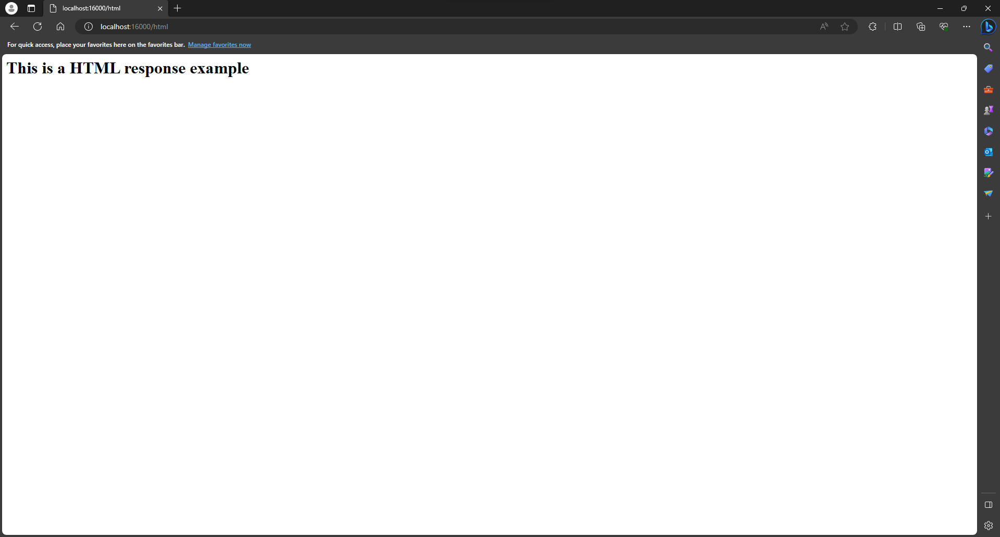
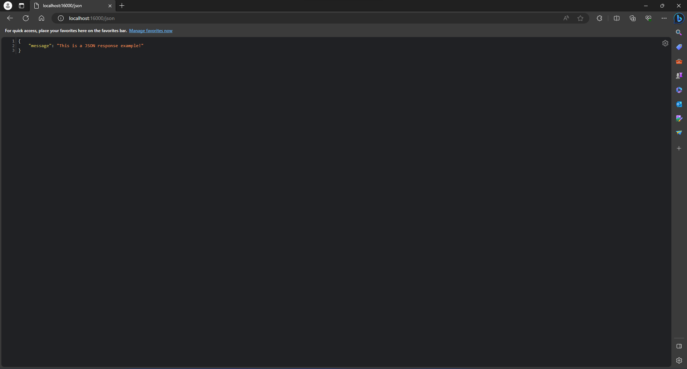
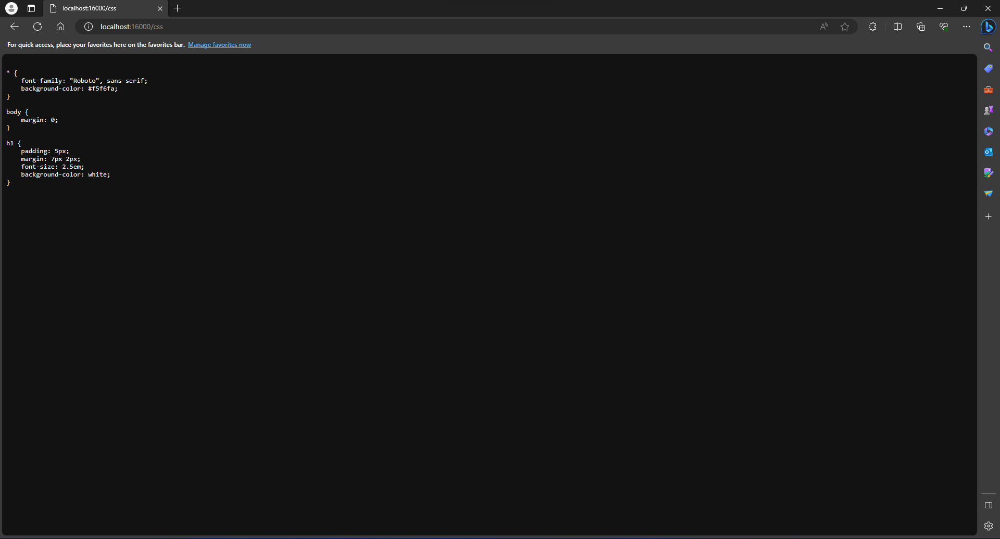

# Object Meta-Protocols, IoC Pattern and Reflection

Web Server that supports functionality similar to Spring, loads classes with the @Component annotation and registers its methods so the Web Server is able to use them.

### Prerequisites

To run the software you will need to have these installed in your machine:

* [Java](https://www.java.com/)
* [Maven](https://maven.apache.org/)

### Installing

Start cloning the GitHub repository, you can use the following command to do so:

```
git clone https://github.com/miguelsalamanca007/Taller4AREP.git
```

Locate yourself in the directory you downloaded the repository in

```
cd /path/to/repo
```

Build and package the project using Maven's package command

```
mvn package
```

## Running the program

Run the following command to clean any old artifacts and then compile and install the new artifacts
```
mvn clean install
```
Now run the program using the command:
```
java -cp .\target\primer-taller-1.0-SNAPSHOT.jar edu.escuelaing.arep.app.webserver.ApplicationExample
```
## Example

In this repository there is a class called "WebComponent" that has the @Component annotation, the webserver loads all the methods of that class and registers them into the server, the methods return a HTML, JSON and CSS file.

### HTML file:

### JSON file

### CSS file:


## Built With

* [Java](https://www.java.com/) - The programming language used
* [HTML](https://html.com/document/) - The markup language used for the home's page structure
* [JavaScript](https://www.javascript.com/) - The programming language used for the front's page logic
* [Maven](https://maven.apache.org/) - Dependency Management

## Versioning

I use [Git](https://git-scm.com/) for versioning.

## Authors

* **Miguel Angel Salamanca**  - [GitHub](https://github.com/miguelsalamanca007) - [LinkedIn](https://linkedin.com/miguel)

